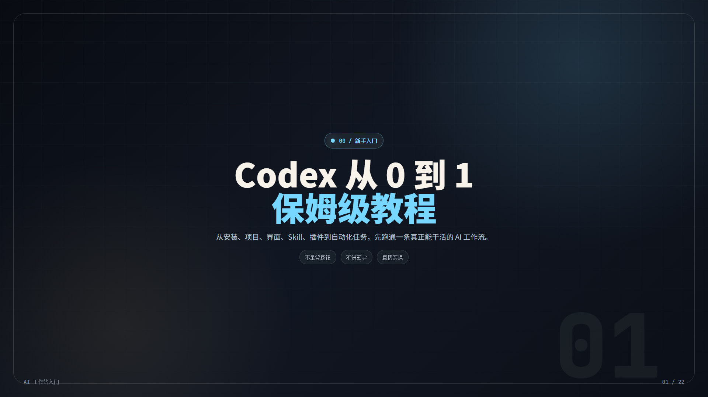
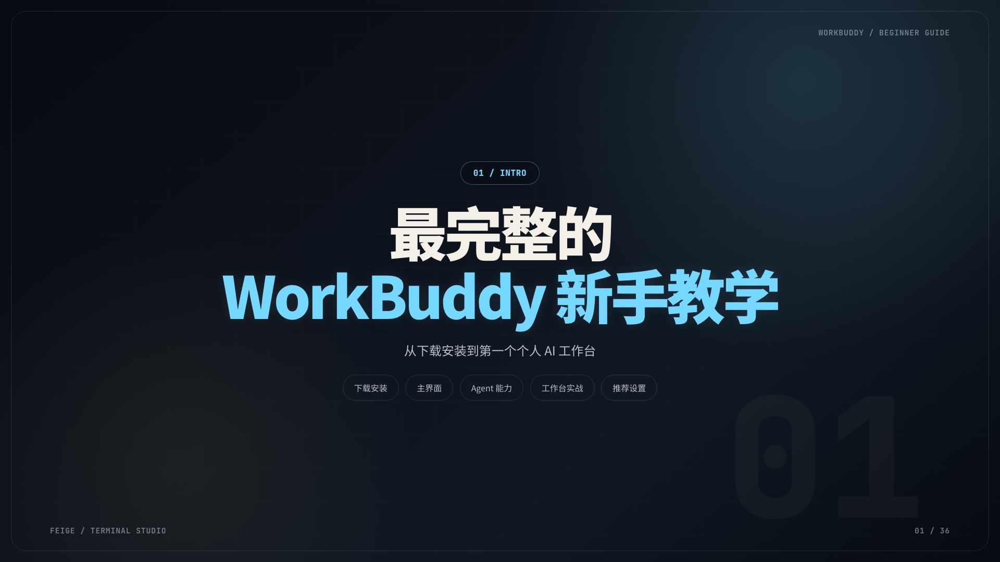
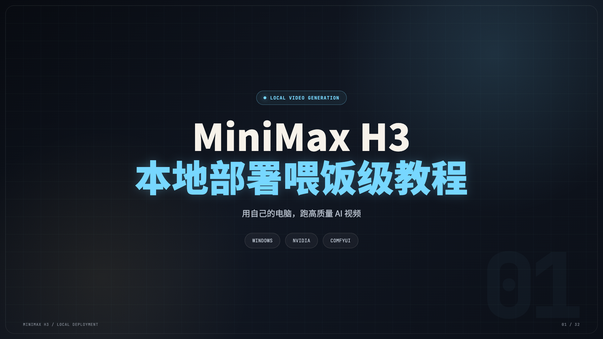
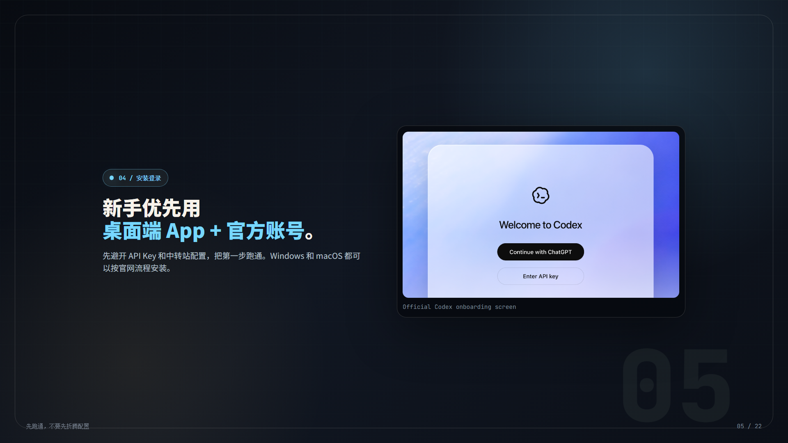
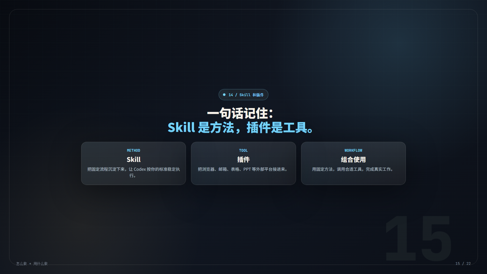
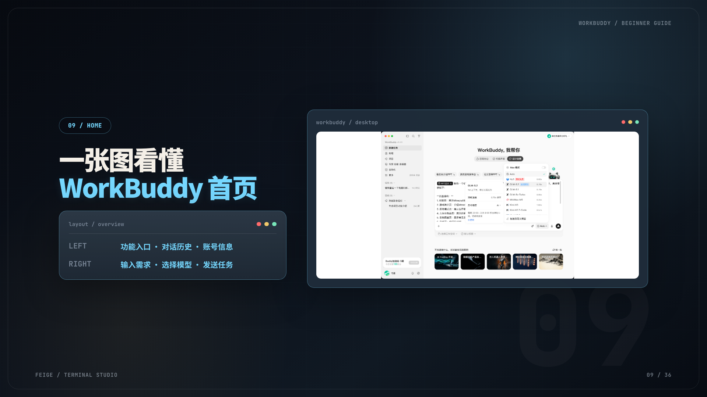
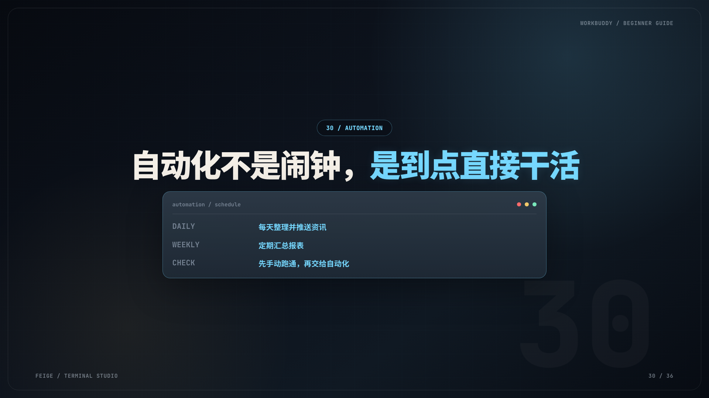
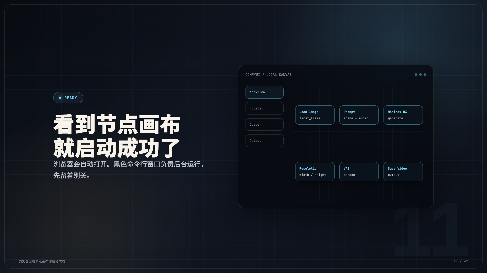
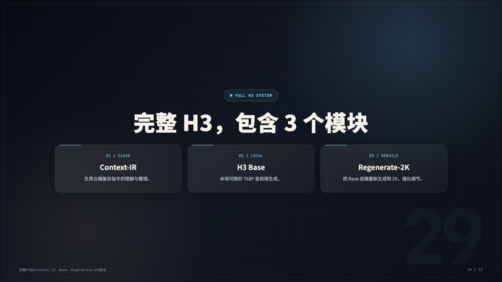

# 深蓝科技风 PPT Agent Skill

<div align="center">

**把中文教程脚本稳定转换成风格统一、可逐页导出的深蓝科技风演示图片。**

面向 Codex 等支持 Agent Skill 的宿主环境，提供内容拆页规则、两套锁定母版、源码与浏览器门禁，以及经过核验的真实案例。

<p>
  
  
  
  
  
</p>

[快速开始](#快速开始) · [真实能力](#真实能力与边界) · [工作流](#工作流) · [案例](#真实案例) · [质量门禁](#质量门禁) · [许可证](#许可证与案例授权)

</div>

<p align="center">
  
  
  
</p>

## 这是什么

这是一套 **image-first 的静态演示图片 Agent Skill**。输入中文脚本、Markdown、教程提纲或已经确认的内容结构，调用该 Skill 的 Agent 会按真实源稿拆页，使用锁定的深蓝母版生成静态 HTML，再通过浏览器导出逐页 PNG，并用 contact sheet 和关键页抽查完成视觉复盘。

它不是可交互演示网站，也不是 PowerPoint 编辑器。HTML 只是稳定排版和浏览器渲染的载体，PNG 才是默认面向视频剪辑与内容发布的交付格式。

### 仓库提供什么

| 仓库内置 | 由调用该 Skill 的宿主 Agent 完成 |
|---|---|
| `SKILL.md`：工作流、内容与视觉约束 | 读取真实源稿并制定页面计划 |
| 两套 HTML 母版：16:9、1:1 | 复制母版并写入本次内容 |
| 标题、字体、画布和安全区规范 | 使用浏览器按目标 viewport 逐页截图 |
| 源码门禁与 Playwright 浏览器门禁 | 使用图像工具生成 contact sheet 和关键页预览 |
| 三套真实案例及来源、尺寸、SHA-256 | 逐张检查标题、截图、溢出、节奏与事实覆盖 |

> [!IMPORTANT]
> 仓库当前提供母版和质量门禁，不包含独立的 PNG 导出器或 contact sheet 生成器。逐页截图与拼图依赖宿主 Agent 的浏览器和图像处理能力。

## 快速开始

### 1. 安装 Skill

直接克隆仓库，并把 Skill 挂载到目标项目的 `.agents/skills/`：

```bash
git clone https://github.com/s840207702/deep-blue-tech-ppt-agent-skill.git /path/to/deep-blue-tech-ppt-agent-skill
mkdir -p "/path/to/project/.agents/skills"
ln -s "/path/to/deep-blue-tech-ppt-agent-skill" "/path/to/project/.agents/skills/deep-blue-tech-ppt"
```

### 2. 直接调用

16:9 教程图片：

```text
使用 $deep-blue-tech-ppt，把这篇中文教程脚本制作成 16:9 静态演示图片。
保留原稿含义，按内容决定页数；交付 HTML、逐页 PNG、contact sheet 和关键页预览。
```

1:1 方形图片：

```text
使用 $deep-blue-tech-ppt，把这篇 Markdown 制作成 1:1 演示图片。
画布、浏览器 viewport、截图区域和最终 PNG 统一使用 1920×1920。
```

修补指定页面：

```text
使用 $deep-blue-tech-ppt，只修第 4 页标题断行和第 12 页底部安全区。
建立新的 patch 输出目录，只重导相关页面和 contact sheet，不覆盖旧素材。
```

## 真实能力与边界

| 已支持 | 真实边界 |
|---|---|
| 教程拆页 | 一页一个教学点；页数由源稿决定，不套固定页数 |
| 来源准确 | 要求 Agent 对照真实源稿，不臆造入口、按钮、功能、链接和结论；这是一项工作流约束，不是自动事实核验器 |
| 内容覆盖 | 对关键术语、步骤、风险提醒、例子和结论建立覆盖检查 |
| 深蓝视觉 | 深蓝黑背景、青色强调、统一高字重标题、轻量卡片和低透明页码 |
| 中文标题 QA | 手动语义断行，避免孤字、短尾、自动换行和字体漂移 |
| 截图整合 | 把真实界面放入深色圆角框，兼顾可读性和视觉层级 |
| 内置画布 | 16:9 为 1920×1080；1:1 为 1920×1920 |
| 静态渲染 | 单个 HTML 固定页面布局，使用 `?slide=N` 选择导出页 |
| 风格回归 | 源码门禁检查锁定 token，Playwright 门禁检查浏览器计算样式、真实 FontFace 和图片自然尺寸 |
| 不可变输出 | 每次生成、修补和重导使用新的 run id，不覆盖旧素材 |

当前只内置并验证了 **16:9 和 1:1**。其他比例需要新增独立 profile、母版和验证规则，不能直接视为已支持能力。

以下内容不属于当前对外承诺：

- 键盘、滚轮、触摸滑动等交互导航；
- 导航圆点、进度动画或入场动画；
- 在线公开部署；
- PDF 导出；
- 可编辑 `.ppt` / `.pptx` 生成或编辑；
- 仓库内置的一键 PNG/contact-sheet 导出 CLI。

## 工作流

```text
真实源稿
   ↓
来源与内容覆盖检查
   ↓
页面计划 + 中文标题语义断行
   ↓
复制 16:9 或 1:1 锁定母版
   ↓
源码风格门禁
   ↓
Playwright 真实浏览器门禁
   ↓
宿主 Agent 逐页截图
   ↓
contact sheet + 关键页人工 QA
   ↓
新的不可变输出包
```

### 设计原则

- 一张图只承担一个核心观点、步骤、判断或视觉事件。
- 内容太多时拆页，不靠缩小字号硬塞。
- 所有可见文案都面向观众，不保留制作备注。
- 中文标题按语义手动断行，cover、chapter、quote、closing 和普通内容页共享同一套标题系统。
- 截图不直接铺满画布，而是放入深色圆角框。
- 避免廉价渐变、霓虹堆叠、通用 SaaS 模板、Bootstrap 卡片感和无关图库图。

完整规范见 [references/style-spec.md](references/style-spec.md)。

## 稳定视觉配置

| Profile | 画布 | 母版 |
|---|---:|---|
| `terminal-studio-16x9-v1` | 1920×1080 | [assets/terminal-studio-16x9.html](assets/terminal-studio-16x9.html) |
| `terminal-studio-1x1-v1` | 1920×1920 | [assets/terminal-studio-1x1.html](assets/terminal-studio-1x1.html) |

两个 profile 共享锁定标题基线：

- 标题字体：`Noto Sans SC`，字重 `900`；
- 标签和页码：`JetBrains Mono`；
- 封面字号：`clamp(3.7rem, 6vw, 6.4rem)`；
- 内容页主标题字号：`clamp(3rem, 5vw, 5.3rem)`；
- 主标题字距：`-0.045em`；
- 主标题行高：`1.08`。

内容、卡片数量、截图和布局组合可以变化；除非用户明确要求更换风格，否则不得重新发明另一套标题系统。

## 真实案例

README 只展示每套教程的第一张和少量代表页。完整来源标识、页码、尺寸和 SHA-256 见 [cases/CASE_INDEX.md](cases/CASE_INDEX.md)，图片授权边界见 [cases/LICENSE.md](cases/LICENSE.md)。案例图片只证明静态演示图片能力，不证明交互、动画、部署、PDF 或 PPTX 能力。

### Codex 从 0 到 1 保姆级教程

图片页码显示整套为 22 页；维护者根据未公开生产工程核验到 15 张明确命名的 `terminal-studio` 图片。本仓库只收录第 1、5、15 页，共 3 张。

<p align="center">
  
  
</p>

### WorkBuddy 新手教学

36 页、1920×1080。展示长教程拆页、真实界面整合、功能说明和自动化边界。

<p align="center">
  
  
</p>

[查看 36 页 contact sheet](cases/workbuddy-beginner/contact-sheet.png)

### MiniMax H3 本地部署喂饭级教程

32 页、1920×1080。展示本地部署环境、节点工作流、模型模块和操作结论。

<p align="center">
  
  
</p>

[查看 32 页 contact sheet](cases/minimax-h3-local/contact-sheet.png)

## 质量门禁

源码门禁只使用 Python 标准库。真实浏览器门禁使用锁定在 `package-lock.json` 中的 Playwright 开发依赖。

```bash
npm ci

python3 scripts/validate_style.py assets/terminal-studio-16x9.html
python3 scripts/validate_style.py assets/terminal-studio-1x1.html

python3 scripts/verify_rendered_style.py assets/terminal-studio-16x9.html
python3 scripts/verify_rendered_style.py assets/terminal-studio-1x1.html

python3 scripts/test_validate_style.py
python3 scripts/test_rendered_style.py
```

如果系统没有 Chrome、Chromium 或 Edge，再运行 `npx playwright install chromium`；也可以通过 `CHROME_PATH` 指定浏览器可执行文件。运行渲染测试时应确认测试真实执行，而不是因为缺少 Node、Playwright 或浏览器而跳过。

### 字体与图片

- 默认母版会访问 Google Fonts，加载 `Noto Sans SC` 和 `JetBrains Mono`。
- 离线或无法访问 Google Fonts 的环境，需要提供等价的本地 `@font-face`。
- 浏览器门禁会验证实际加载的标题与等宽字体，以及图片 `naturalWidth` / `naturalHeight`，不允许系统回退字体或缺图静默通过。
- 自动门禁不能替代逐页看图；错图、长文本和复杂截图仍需通过 PNG 与 contact sheet 人工复核。

生成出的 HTML 和 PNG 不依赖 npm，也不需要构建或运行开发服务器。

## 仓库结构

```text
.
├── SKILL.md                       # Agent Skill 入口
├── agents/openai.yaml             # UI 元数据与默认提示词
├── assets/                        # 16:9、1:1 锁定母版
├── references/                    # 风格、画布与 HTML 约定
├── scripts/                       # 源码门禁、浏览器门禁与测试
├── cases/                         # 精选静态案例与证据索引
├── package.json                   # Playwright QA 开发依赖
├── package-lock.json              # 锁定依赖版本
├── CONTRIBUTING.md                # 贡献范围与验证要求
├── LICENSE                        # MIT License
├── SECURITY.md                    # 安全与公开发布边界
└── README.md
```

## 发布前自检

```bash
git diff --check
git ls-files
git grep -n -I -E 'api[_-]?key|access[_-]?token|client[_-]?secret|BEGIN .*PRIVATE KEY|password'
npm audit --package-lock-only
```

还应人工确认：

- README 中所有本地图片和文档链接均可解析；
- 案例图片尺寸和 SHA-256 与 `cases/CASE_INDEX.md` 一致；
- 没有原始脚本、账号、uTools 数据库、剪辑工程、缓存、令牌、证书或私钥；
- 当前 Git 历史不包含不应公开的作者信息、旧案例或已撤回能力；
- 案例图片具备公开展示所需授权；
- README 与 `SKILL.md` 只描述仓库真实存在的能力。

## 许可证与案例授权

除案例 PNG 外，本项目的代码、Skill 指令、HTML 母版、验证脚本和文档采用 [MIT License](LICENSE)。

`cases/` 下的 PNG 图片不属于 MIT 授权范围，版权归 `Feige (s840207702)` 所有，只用于本仓库展示和风格回归，不授予复制、修改、再发布、商业使用或作为素材包分发的权利。完整条款见 [cases/LICENSE.md](cases/LICENSE.md)。

第三方产品名称、商标和界面仅用于教程说明，不暗示官方背书。安全与公开发布边界见 [SECURITY.md](SECURITY.md)。

## 致谢

README 的信息架构参考了 [readme-ai](https://github.com/eli64s/readme-ai) 对项目首屏、快速导航、能力分区和 Getting Started 的组织方式。本仓库没有把 `readme-ai` 作为运行依赖，也没有让自动生成内容取代事实核验。
